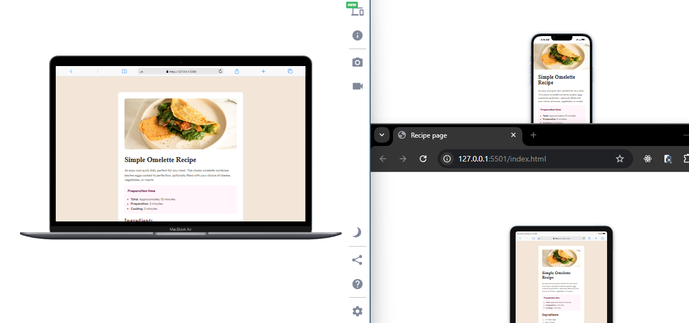

## Table of contents

- [Overview](#overview)
  - [Screenshot](#screenshot)
  - [Links](#links)
- [My process](#my-process)
  - [Built with](#built-with)
  - [What I learned](#what-i-learned)
  - [Useful resources](#useful-resources)
- [Author](#author)
- [Acknowledgments](#acknowledgments)

## Overview
This Recipe Page Frontend project is a responsive web page designed to display visually appealing and user-friendly recipe. Built with HTML and TailwindCSS, the page adapts seamlessly to various screen sizes, ensuring a smooth and consistent user experience across mobile, tablet, and desktop devices

### Screenshot

### Links

- Solution URL: [Add solution URL here](https://your-solution-url.com)
- Live Site URL: [Add live site URL here](https://your-live-site-url.com)

## My process

### Built with

- Semantic HTML5 markup
- CSS custom properties
- Tailwind CSS
- Flexbox
- CSS Grid
- Mobile-first workflow

### What I learned

- Use TailwindCSS effectively for rapid UI development.
- Create responsive designs that work on multiple devices.
- Build and organize clean, semantic HTML.
- Enhance user experience through thoughtful layout and design choices.
- To see how you can add code snippets, see below:

### Useful resources

- https://tailwindcss.com/

## Author

- Website - [Stephen Akin](https://stephenakinrodoye-dev.vercel.app/)
- Frontend Mentor - [@stephenakinrodoye](https://www.frontendmentor.io/profile/stephenakinrodoye)
- Twitter - [@Stephen_Akinrod](https://x.com/Stephen_Akinrod)
- LinkedIn - [Stephen Akinrodoye](https://www.linkedin.com/in/stephen-akinrodoye/)

## Acknowledgments

I want to appreciate [Popoola Ramat](https://github.com/Rampop01) and [Sunmonu Rukayat](https://github.com/RUKKY76) for their unwavering support
